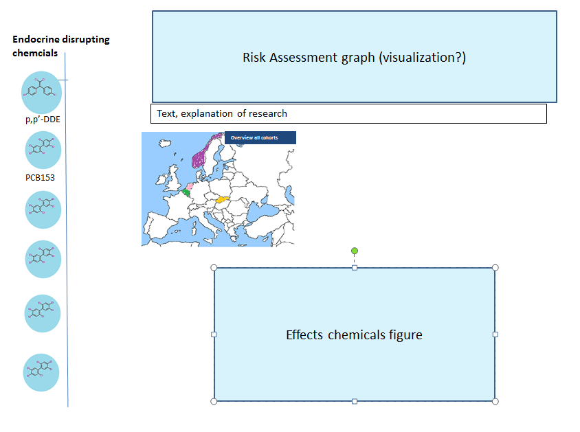
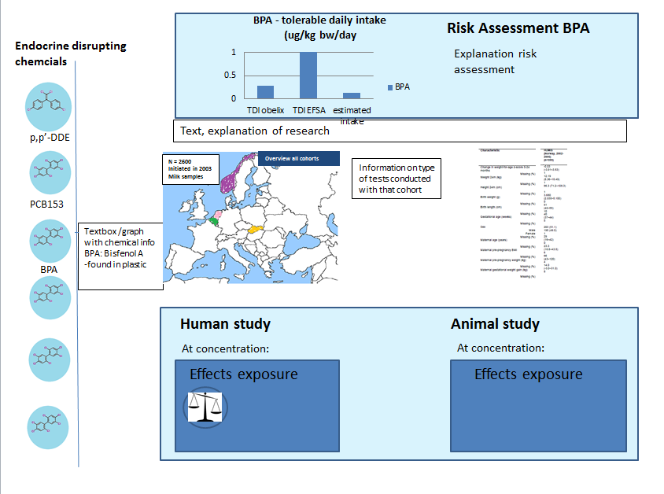

# Project - DESIGN
Project - Data Visualization of the OBELIX research
Kyra Kieskamp

The goal of this project is to create a general and understandable interactive overview (visualization) of the OBELIX research (or part of the research for the Minimum Viable Product) for the general public. The Obelix study is a large scale research investigating the effect of certain chemicals on potential development of obesity. In the interactive visualization various objectives of this study will be visualized and final results will be presented. 
In this DESIGN document, the to be implemented features, advanced sketches, the visualization functionality, and the data types and data sources will be discussed. 

# Feature implementation
For the implemented features both a minimum viable product (MVP) is presented as well as possible additional implementations and functionality. The features indicated for the MVP have to be totally finalized in 2 weeks. 

#Minimum Viable Product (MVP)
- •	A risk assessment bar graph of the 2 chemicals which the OBELIX project proposed as risk-chemicals. One graph where they are together (initial visualization), and two separate bar graphs for each chemical. 
- 	o	Comparison between found chemical levels in the OBELIX study and the chemical levels used to calculate the current tolerable daily intake (TDI).
- •	Overview of 2 chemicals researched in the OBELIX study (and their characteristics, type of chemicals, etc). 
- 	o	Represented as image in a blue circle on the left hand side of the webpage
- 	o	A text box for the characteristics.
- •	Map of Europe representing the mother-child cohorts of the OBELIX study. 
- •	Characteristics of the mother-child cohorts. 
- 	o	Visualization type: table. 
- •	Visualization of effects determined from mouse models for the chemicals in the OBELIX study.
-	o	Images presenting the type of effect (see the balance image at Human study in the second advanced sketch) – this will be alike for the mouse model, aka. Animal study. 
- •	Visualization of effects in humans after exposure to OBELIX chemicals.
-	o	Images presenting the type of effect (see the balance image at Human study in the second advanced sketch)

#Expansion on MVP

•	A risk assessment bar graph for all other OBELIX chemicals. 
	o	Comparison between found chemical levels in the OBELIX study and the chemical levels used to calculate the current tolerable daily intake (TDI).
•	Overview of all chemicals researched in the OBELIX study (and their characteristics, type of chemicals, etc). 
	o	Represented as image in a blue circle on the left hand side of the webpage.
	o	A text box for the characteristics.
	o	Bar graph with chemical concentrations in food or/and in the environment (for all chemicals). 
•	Expansion on graphs human study and mouse study
	o	Line graphs with exact type of effect at exactly which concentration. 

The HTML page will be made in html. A dashboard will be used for connecting the features. The features (bar graph, line graph) will be created with D3/svg. 

Idea after Friday’s presentation:
Interactive map with the cohorts (mother-child participants) and the information pop-up will be changed to an interactive table. This will be thought through before Monday. MVP will change from map of Europe to a table. The interaction in that table will be an expansion on the MVP. For example, that the user can choose specific topics of the cohort (breastfeeding, child weight, mother length etc.), and that these topics will show up. Part of the interaction for the graphs of the study (human study and mouse model), will then be integrated in the MVP. This interaction will be thought through further before Monday. Potentially, a line graph with increasing concentration of that chemical will be implemented (after a mouse click), and icons for the specific effect at a given concentration will be positioned on that line. 

#Advanced sketches 
Two sketches are presented. The first one is the initial sketch. This is an approximation of how the visualization is presented to the user at first glance. The second sketch represents various elements that are presented by various mouse-hover or mouse-click activities. 

The initial basic sketch:

The sketch with various mouse-hover/mouse-click implementations:

Idea after Friday's presentation:
Interactive map with the cohorts (mother-child participants) and the information pop-up will be changed to an interactive table. This will be thought through before Monday.

#Visualization functionality
Creating a dashboard with all the features mentioned in the ‘Feature Implementation’ section. Various features will be bound together (via the dashboard) so that interaction between graphs is possible. This is especially necessary to change all graphs to the information for one specific chemical. 

#Minimum Viable Product (MVP)
Interaction between features:

•	With the following mouse actions on the chemical images on the left side of the webpage (see advanced sketches).
	o	Mouse-hover: Information on the chemical will show up in a text box.
	o	Mouse-click: The graphs for the Risk Assessment (top of webpage), the explanatory text for the Risk Assessment, and the visualizations for the human study and animal study will change to present the data for the clicked chemical. 
•	Europe/cohort map.
	o	On mouse-hover over country: Information on the cohort in the country will pop-up.
	o	On mouse-click on country: Detailed information in a table on the cohort in the country will show up besides the map. 

#Expansion on MVP
Interaction between features:

•	With the following mouse actions on the chemical images on the left side of the webpage (see advanced sketches).
	o	Mouse-hover: Further information on food/environmental concentrations will show as well, besides just the text box.
•	Human study and animal study
	o	On mouse-hover on effect image: Short description of the effect shown is given in a pop-up. (For example, with the balance image: This stands for an adverse effect noticed in the energy-balance of a person/animal, and this means that….). 
	o	On mouse-click on effect image: A text box/graph appears with more detailed information on the specific health-effects. For example, at which different concentrations this was noticed, how reliable the data is, in which cohorts/animals this data was found. 

Idea after Friday’s presentation:
Interactive map with the cohorts (mother-child participants) and the information pop-up will be changed to an interactive table. This will be thought through before Monday. Additionally, a line graph with increasing concentration of that chemical will be implemented (after a mouse click), and icons for the specific effect at a given concentration will be positioned on that line. Part of this interactivity will be incorporated in the MVP. 

#List of data sources, and database tables and fields 
Various data sources are used for this visualization. Most data is obtained from articles correletated to or part of the OBELIX project. Other data on the chemicals or on human exposure is obtained from the website of the European Food Safety Authority (EFSA). The images of chemicals are mainly obtained from a chemical database called ChemSpider.

Overview of all the data:
Format: Database type/table (data source)
•	Chemical data
	o	Images (web/chemspider)
	o	Characteristics (EFSA database)
	o	Environment/food (probably EFSA database)
•	Human Study data 
	o	Characteristics (OBELIX published articles)
	o	Pre/postnatal data (OBELIX published articles)
	o	relation exposure --> weight (OBELIX pubished articles)
	o	Effects of chemicals (OBELIX final result)
•	Mouse model data
	o	Characteristics (OBELIX final result/other published articles)
	o	Chemical levels (OBELIX final result/other published articles)
•	Risk Assessment data
	o	Values OBELIX chemical levels (OBELIX final result)
	o	Values compared chemcial levels (OBELIX final result)

More details in: project/raw_data/W1_Overview_datatypes_O05012016

The data will be transformed to JSON format per item, and be sorted per chemical. 