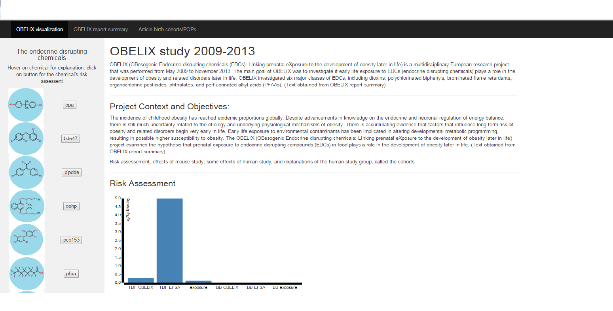
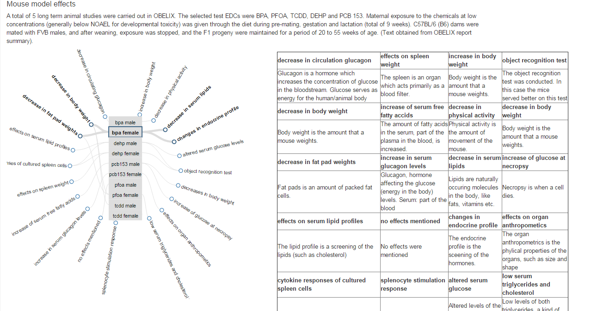
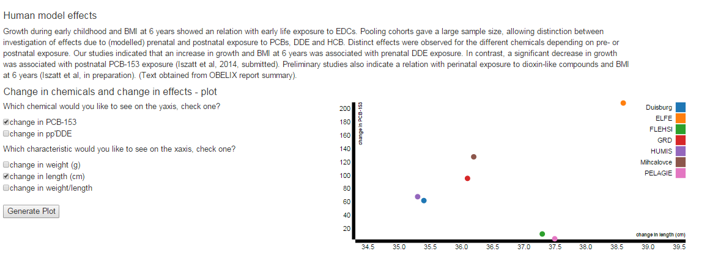
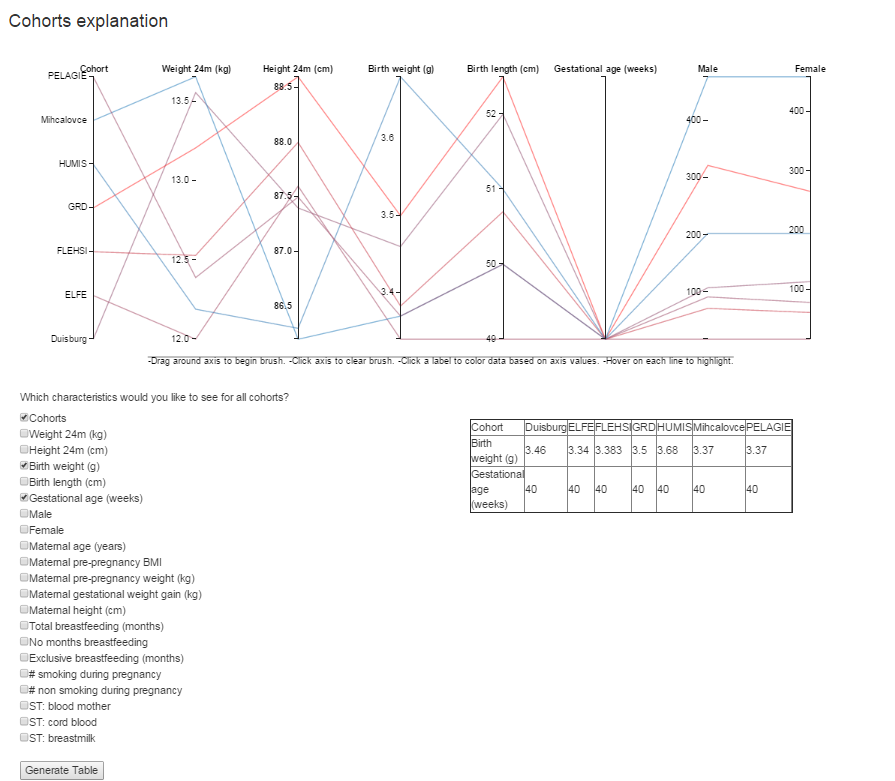

# Project
Project - Data Visualization of the OBELIX research;
Author: Kyra Kieskamp;
Copyright © 2016 Kyra Kieskamp, Licensed under the Apache License, Version 2.0.

#Project purpose
The purpose of this project is to show a general interactive overview of the OBELIX research. OBELIX was a 4-year running, 2009-2013, European-Commission funded research project with its goal to investigate the effects of prenatal exposure to various endocrine disrupting chemicals on the development of obesity later in life (http://www.theobelixproject.org/). Endocrine disrupting chemicals are chemicals that can affect hormonal levels and their activity inside the body. The interactive visualization shows the following parts of the study: the final results of the risk assessment of the studied chemicals, the effects observed during the animal study, a comparison between exposure of chemicals and the effects (growth) in babies in the studied cohorts (groups of people), and an overview of various characteristics of those cohorts. For understanding this interactive visualization, some background in (environmental) toxicology and scientific research is advised. 

#Screen shots
A couple of images from the project are as follows: 
Risk assessment graph

Visualization of the effects in the animal study

Scatterplot of effect in the human study

Characteristics of the cohorts in the human study

# Directory naviagtion
Navigation through the project directory: index.html contains the final version of this project. The style.css contains all style script. All images used in the html page can be found in the images directory. All files used for data conversion are in the scripts directory. All javascript files are in javascript directory. All csv, tsv and json files are in the data directory. As d3 is used, it is added to the project directory as well. The prototype directory still contains 2 prototype html versions. 

#External code sources:
Links from which script-parts are used and/or adapted, part of their licences can be found in "LICENCE":
checkboxes: http://www.w3schools.com/jsref/tryit.asp?filename=tryjsref_checkbox_order
dynamical table: https://developer.mozilla.org/en-US/docs/Traversing_an_HTML_table_with_JavaScript_and_DOM_Interfaces
scatterplot: http://bl.ocks.org/weiglemc/6185069
parallel coordinates: http://bl.ocks.org/jasondavies/1341281
http://bl.ocks.org/mostaphaRoudsari/b4e090bb50146d88aec4
concept map: http://bl.ocks.org/virtuald/ea7438cb8c6913196d8e
D3: This map contains its own licence. 